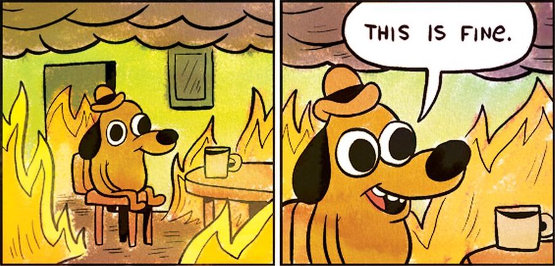
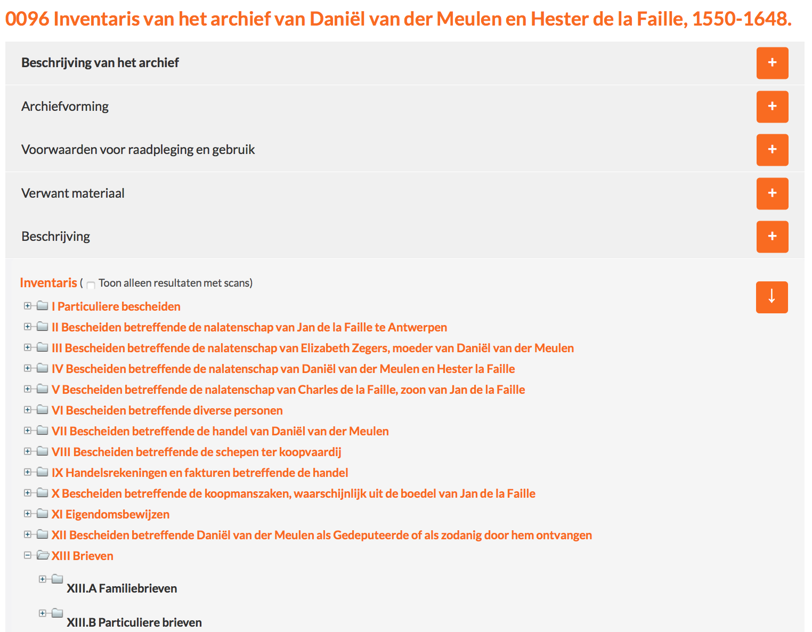
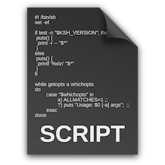
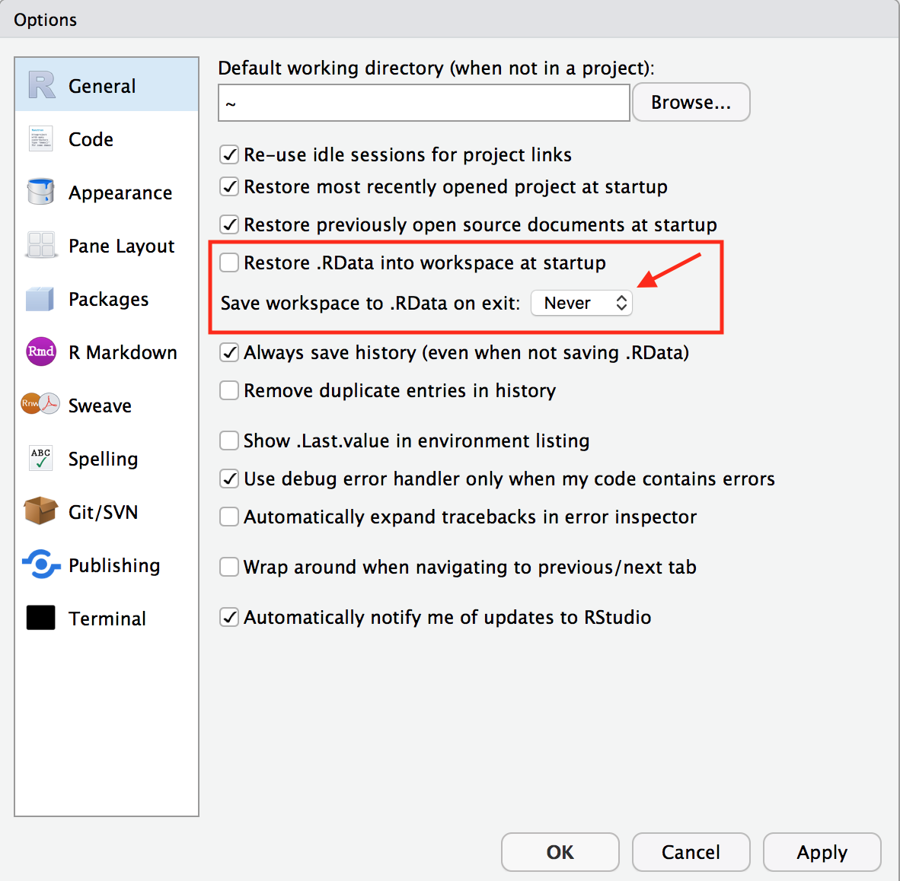
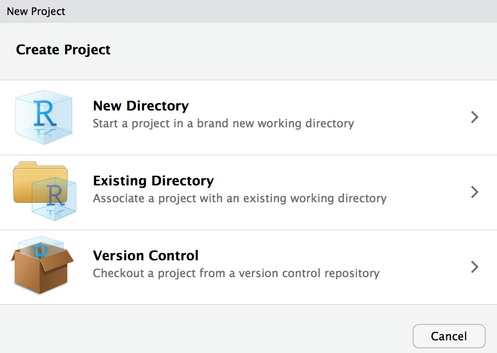
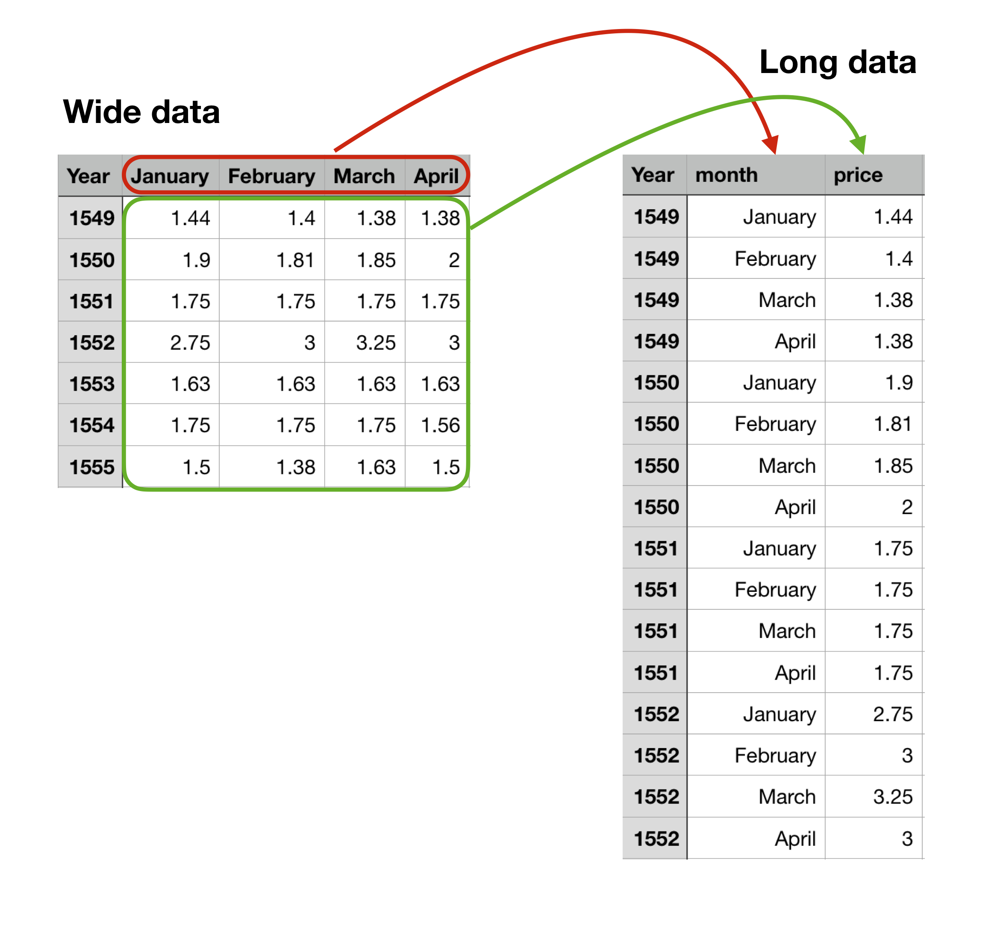

```{r setup, include=FALSE}
options(htmltools.dir.version = FALSE)
knitr::opts_chunk$set(warning = FALSE, message = FALSE, 
  comment = NA, dpi = 300,
  fig.align = "center", cache = FALSE)
```

```{css, echo=FALSE}
pre {
  max-width: 100%;
  overflow-x: scroll;
}
```

# Agenda

## 1. Why use code for Digital Humanities
## 2. Introduction to R
## 3. Learning to code in R

---
class: inverse, center, middle

# 1. Why use code for Digital Humanities

---
class: center, inverse

## The power of code

```{r echo = FALSE}
knitr::include_graphics("https://media.giphy.com/media/BemKqR9RDK4V2/giphy.gif")
```

---
class: center, inverse

## How do you harness the power?

```{r echo = FALSE}
knitr::include_graphics("https://media.giphy.com/media/3oKIPnAiaMCws8nOsE/giphy.gif")
```

---
## The spreadsheet: The first killer app

```{r echo = FALSE}
knitr::include_graphics("images/excel.png")
```

---
# Spreadsheets are nice

👍 Nice way to enter and look at data

👍 Programatic logic in cells and creation of visualizations

👍 What you see is what you get (WYSIWYG)

---

# Spreadsheets are nice, but...

👍 Nice way to enter and look at data

👍 Programatic logic in cells and creation of visualizations

👍 What you see is what you get (WYSIWYG)

👎 Mixing of data entry and analysis

👎 Mouse clicks or mistaken drags can lead to errors

👎 No way to track changes: Do you want to save changes?

---
# Other options

- GUI (Graphical User Interface) applications
    - Tableau
    - Gephi
    - QGIS

--

- Web based
    - Google maps
    - Palladio

--

- Programming languages (Command line interface)
    - Java Script
    - Python
    - R

---
# Programming languages...

👎 Have a steep learning curve

--

👍 Powerful and endlessly customizable 💪💪

--

👍 Transparent: Every step can be clearly documented

--

👍 Transferable: To new data and to other people

--

👍 Reproducible

--

👍 Build open-source communities of shared problems and answers 👯

---
# How do I get started?

## Find a project

--

.center[
```{r echo = FALSE, out.width = "75%"}
knitr::include_graphics("images/draw-owl.jpeg")
```
]

---
# A warning: Writing code is frustrating

.center[
```{r echo = FALSE}
knitr::include_graphics("https://media.giphy.com/media/nkLB4Gp8H6hFe/giphy.gif")
```
]

---
## But frustration is normal and consequences are small

```{r echo = FALSE, out.width = "100%"}

```

---
# Why R

- Open Source: It's free

--

- Built for data analysis

--

- Powerful visualization tools

--

- Popular inside and outside academia

--

- Strong community of teachers, learners, and programmers

.center[
```{r echo = FALSE, out.width = "25%"}
knitr::include_graphics("images/Rlogo.png")
```

]

---
class: inverse, center, middle

# 2. Introduction to R

---
# Download and Install R

1. [Go to the R Project for Statistical Computing website](https://www.r-project.org)

2. [Click on the download link](https://cran.r-project.org/mirrors.html)

3. Choose a server from which to download R
    - [RStudio servers](https://cloud.r-project.org/)
    - [Michigan Technological University](https://cran.mtu.edu/)

4. Select your operating system

5. Mac
    - Click on the pkg file of the latest release
    - Follow installation instructions

6. Windows
    - Click on Base: Install R for the first time
    - Click on the download link
    - Follow installation instructions

---
# Download and Install RStudio

1. [Go to the RStudio website](https://www.rstudio.com)

2. [Click on the Download RStudio link](https://www.rstudio.com/products/rstudio/download/)

3. [Click on the RStudio Desktop: Open Source License link](https://www.rstudio.com/products/rstudio/download/#download)

4. Select your operating system

5. Follow the installation instructions

6. Open the application and make sure everything works

---
## What is RStudio and how is it different from R?

.pull-left[
## R: Archives

```{r echo = FALSE, out.width = "75%"}
knitr::include_graphics("images/archive.jpg")
```
]

.pull-right[
## RStudio: Catalogue

```{r echo = FALSE}

```
]

???

- R is the actual programming language that performs the commands
- RStudio is an IDE (Integrated development environment) or GUI that helps you write and organize code
- R is necessary to use RStudio, but R is more complex and confusing without RStudio

---
# RStudio

.center[
```{r echo = FALSE}
knitr::include_graphics("images/RStudio.png")
```
]

---
# RStudio

.center[
```{r echo = FALSE}
knitr::include_graphics("images/RStudio-script.png")
```
]

---
class: inverse, center, middle

# Let's run some code

---
# Running code

Run code in the console

```{r}
5 + 10
```

--
Use the assignment operator to create named variables or objects

```{r}
x <- 3 * 2
```

---
# Running code

Functions take in objects, perform some set of operations, and return another object
```{r, eval = FALSE}
function_name(argument1 = value1, argument2 = value2, ...)
```

--
Like the sequence function, which creates a vector of numbers
```{r}
seq(from = 1, to = 20, length.out = x)
```

--
If you need help, use `?function_name()` and look at the examples
```{r, eval = FALSE}
?seq()
```

---
class: inverse, center, middle

# Expanding R and the tidyverse

---
# Expanding R and the tidyverse

- Base R: Packages that come with R

--
 
- Expand base R with packages

--

- [Comprehensive R Archive Network: CRAN](https://cran.r-project.org)

--

- [The tidyverse](https://tidyverse.org)

???

Could have Shiny app of CRAN downloads on another tab

---
# What is the tidyverse

.pull-left[
## Hadley Wickham

```{r echo = FALSE, out.width = "75%"}
knitr::include_graphics("images/wickham.jpg")
```
]

.pull-right[
## The tidyverse

```{r echo = FALSE}
knitr::include_graphics("images/tidyverse.jpeg")
```
]

---
## Downloading packages

To download packages use `install.packages()`: make sure to include the quotation marks

```{r, eval = FALSE}
install.packages("tidyverse")
```

## Loading packages

To use a package it has to be loaded

```{r, message = FALSE}
library(tidyverse)
```

---
# Check that everything works

```{r mpg, out.width = "50%", message = FALSE}
ggplot(data = mpg, aes(x = hwy, y = displ)) +
    geom_point() + 
    geom_smooth()
```

---
class: inverse, center, middle

# Setting up the enironment for coding in RStudio

---
# What is real and what is not

.pull-left[
## Real and reproducible

Scripts: text files with .R extension

```{r echo = FALSE, out.width = "75%"}

```
]

.pull-right[
## Temporary

Code typed in the console or objects created from the code

```{r, eval = TRUE}
x <- 5
y <- x + 10

y
```
]

---

# Save your scripts, not your environment

Tools > Global Options

.center[
```{r echo = FALSE, out.width = "60%"}

```
]

---
# Organizing your scripts and data

.pull-left[
## RStudio Projects

```{r echo = FALSE}

```
]

--

.pull-right[
## Organizing projects

```{r, eval = FALSE}
project-name
|--data
    |--cleaned-data.csv
|--data-raw
    |--raw-data.csv
    |--clean-data.R
|--plots
    |--bar-plot.png
    |--scatter-plot.png
|--project-name.Rproj
|--scripts
    |--exploratory-analysis.R
    |--create-plots.R
```
]

???
Create a project in a new directory
Create a script

---
class: center, middle

# Download tutorial

## https://github.com/jessesadler

---
class: inverse, center, middle

# 3. Learning to code in R

---
class: inverse, center, middle
# Import data with `readr`

See script: 03-loading-data.R

---
# Import data

**Remember to load the tidyverse**
```{r message = FALSE}
library(tidyverse)
```

Import the raw data with `read_csv()`
```{r eval = FALSE}
letters <- read_csv("data-raw/dvdm-correspondence-1591.csv")
```

```{r echo = FALSE}
letters <- read_csv("../data-raw/dvdm-correspondence-1591.csv")
```

---
# Inspect the data

Letters sent to Daniel van der Meulen from 1578 to 1592.

```{r}
letters
```

---
# Parse the date variable

```{r, eval = FALSE}
letters <- read_csv("data-raw/dvdm-correspondence-1591.csv",
                    col_types = 
                      cols(date = col_date(format = "%Y%m%d")))
```

```{r echo = FALSE}
letters <- read_csv("../data-raw/dvdm-correspondence-1591.csv",
                    col_types = cols(date = col_date(format = "%Y%m%d")))
```

---
# Saving the data

The converse of `read_csv()` is `write_csv()`.

Write the data frame to the "data" folder with the date variable parsed correctly.
```{r eval = FALSE}
write_csv(letters, "data/dvdm-correspondence.csv")
```

- "data/" places the file in the data folder.
- "dvdm-correspondence.csv" names the file. Make sure to put the csv extension on the end.

--

**Tip**: Minimize the objects that you save. The code that created the objects is more important.

---
class: inverse, center, middle

# Explore data with `dplyr`
```{r echo = FALSE, out.width = "50%"}
knitr::include_graphics("images/dplyr.png")
```

See script: 04-explore-data.R

---
# Explore data with `dplyr`

## Six main verbs

- select: pick variables or columns to keep or discard

- arrange: reorder rows by values in columns

- filter: pick observations or rows by their values

- mutate: create new variables from information from existing variables

- summarise: Collapse observations to a summary value such as count, mean, or median

- group: Group the observations in order to make a summary of them

---
## `select()`

Pick variables or columns to keep or discard
```{r eval = FALSE}
select(letters, writer, date)
```

--
Get rid of variables you do not want to keep
```{r eval = FALSE}
select(letters, -writer, - date)
```

--
Rearrange columns
```{r eval = FALSE}
select(letters, writer, date, destination, source)
```

--
Rename columns within selection: `new_name = old_name`
```{r eval = FALSE}
select(letters, writer, from = source, to = destination)
```

--
To keep all variables but rename one or more use `rename()`
```{r eval = FALSE}
rename(letters, correspondent = writer)
```

---
# `arrange()`

`arrange()` does not change the data. It only alters the presentation of the data.

Arrange rows by values in a variable
```{r eval = FALSE}
arrange(letters, writer)
```

--
Arrange rows by multiple variables
```{r eval = FALSE}
arrange(letters, source, destination)
```

--
Arrange rows in descending order with `desc()`
```{r eval = FALSE}
arrange(letters, desc(date))
```

---
# `filter()`

## Comparison in R: what to keep vs what to discard

- Greater than and less than: `>, >=, <, <=`

- Equal and not equal: `==` and `!=`
    - *note the two equal signs to show equality*

- And, or, not: `&, |, !`

---
# `filter()`

Pick letters sent to Antwerp
```{r eval = FALSE}
filter(letters, destination == "Antwerp")
```

--
Why doesn't this work?
```{r eval = FALSE}
filter(letters, destination == Antwerp)
```

--
Pick letters sent during certain years
```{r eval = FALSE}
filter(letters, year >= 1584 & year <= 1586)
```

--
Remove rows that do not have a known source or destination: `NA`
```{r eval = FALSE}
filter(letters, !is.na(source), !is.na(destination))
```

---
# `mutate()`

Create new variables from information from existing variables
```{r eval = FALSE}
mutate(data, variable_name = function_call)
```

--
Create new variable with dates from Julain calendar for letters sent after 1582.
```{r}
# New data frame with letters after 1582
gregorian_letters <- filter(letters, year > 1582)
```

--
Subtract 10 days from date column of new data frame
```{r eval = FALSE}
# New variable with Julian calendar dates
mutate(gregorian_letters, julian = date - 10)
```

---
# `summarise()`

English spelling comes from Hadley Wickham's birthplace of New Zealand 🇳🇿

You can also use `summarize()` if you prefer the zed 😉

--
`summarise()` has a similar formula to `mutate()`
```{r eval = FALSE}
mutate(data, variable_name = function_call)
```

--
Let's try it with `n()` to count the observations
```{r}
summarise(letters, count = n())
```

🤷🤷🤷🤷🤷🤷🤷🤷🤷

---
## `summarise()` with `group_by()`
Summarise is not very useful without `group_by()`.

--

Group the data frame by a variable and then use `summarise()` and `n()`
```{r}
# create grouped data frame
letters_writer <- group_by(letters, writer)
```

How many letters were written by each correspondent?
```{r eval = FALSE}
summarise(letters_writer, count = n())
```

---
class: inverse, center, middle

# The pipe: %>%
```{r echo = FALSE, out.width = "50%"}
knitr::include_graphics("images/magrittr.png")
```

See script: 05-the-pipe.R

---
# What if you want to perform multiple operations?

How many letters were sent from each location while Daniel lived in Bremen?

--
```{r}
# letters to Bremen
letters_bremen <- filter(letters, destination == "Bremen")

# group data frame by source
bremen_grouped <- group_by(letters_bremen, source)

# number of letters per source
bremen_summarised <- summarise(bremen_grouped, count = n())

# arrange with most at top
finally_done <- arrange(bremen_summarised, desc(count)) 
```

---

background-image: url("https://media.giphy.com/media/tw1zMQrM2IhC8/giphy.gif")
background-size: cover

---

.center[
# The pipe to the rescue
]

.pull-left[
```{r echo = FALSE}
knitr::include_graphics("images/magrittr.png")
```
]

.pull-right[
```{r echo = FALSE}
knitr::include_graphics("https://media.giphy.com/media/D49L3FpxqtQ3u/giphy.gif")
```
]

---
# The pipe: %>%

### Read the pipe as "and then"
Pipe the output of one function directly into the next one

--
```{r eval = FALSE}
data %>% 
  do_this() %>% 
  do_something_else() %>% 
  do_one_more_thing()
```

--
### Keyboard shortcuts

macOS: Cmd+Shift+m

Windows: Ctrl+Shift+M

---
## The pipe: %>%

Let's try to find letters sent to Bremen again with the pipe.

```{r}
letters %>% 
  filter(destination == "Bremen") %>% # letters to Bremen
  group_by(source) %>% # group by source
  summarise(count = n()) %>% # letters per source
  arrange(desc(count)) # most letters at the top
```

---
class: inverse, center, middle

# Relational data with `dplyr`
```{r echo = FALSE, out.width = "50%"}
knitr::include_graphics("images/dplyr.png")
```

See script: 06-relational-data.R

---
## Relational data: working with multiple data frames

.pull-left[
See `?left_join()` for details.

**inner join**
```{r echo = FALSE}
knitr::include_graphics("images/join-inner.png")
```
]

--
.pull-right[
```{r echo = FALSE, out.width = "75%"}
knitr::include_graphics("images/join-outer.png")
```
]

.bottom[
Images from [Wickham and Grolemund, R for Data Science](https://r4ds.had.co.nz/relational-data.html)
]

---
## Join number of letters per writer with kinship and gender data about correspondents
```{r eval = FALSE}
left_join(df1, df2, by = "key_variable")
```

1: Import correspondence data
```{r echo = FALSE, message = FALSE}
correspondents <- read_csv("../data/correspondents.csv")
```

--
```{r eval = FALSE}
correspondents <- read_csv("data/correspondents.csv")
```

2: Set up letters data

--
```{r}

per_writer <- group_by(letters, writer) %>% summarise(count = n())
```


3: Join the two data frames

--
```{r eval = FALSE}
left_join(per_writer, correspondents, by = "writer")
```

Could use any of the joins because all the correspondents are in both data frames.

---
## Join by variables with different names

```{r eval = FALSE}
left_join(df1, df2, by = c("variable1" = "variable2"))
```

--
Rename one of the writer variables and join the data frames
```{r}
rename(per_writer, schrijver = writer) %>% 
  left_join(correspondents, by = c("schrijver" = "writer"))
```

---
class: inverse, center, middle

# Visualization with `ggplot2`
```{r echo = FALSE, out.width = "50%"}
knitr::include_graphics("images/ggplot2.png")
```

See script: 07-ggplot2-scatterplots.R

---
# Making a plot with prices of goods in Holland
.center[
```{r dutch-prices-01, echo = FALSE, out.height = 500}
dutch_prices <- read_csv("../data/dutch-prices.csv")

ggplot(data = dutch_prices, aes(x = year, y = guilders, color = commodity)) +
  geom_point()
```
]

---
class: inverse

# Let's look at the code

```{r dutch-prices-02, out.height=300}
ggplot(data = dutch_prices,
       aes(x = year,
           y = guilders,
           color = commodity)) +
  geom_point()
```

---
## Grammar of graphics

- Data
- Geometric objects (geoms) that provide the type of objects drawn
- Aesthetic mapping of the data such as location, size, or color
- Scales of the plot axes
- Statistical transformation
- Coordinates

--

.pull-left[
```{r dutch-prices-03, fig.show="hide"}
ggplot(data = dutch_prices,
       aes(x = year,
           y = guilders,
           color = commodity)) +
  geom_point()
```
]

.pull-right[
`)
]

---
# Layers: Data

```{r out.height = 400}
ggplot(data = dutch_prices)
```

---
# Layers: aesthetics

```{r out.height = 400}
ggplot(data = dutch_prices,
       aes(x = year, y = guilders)) #<<
```

---
# Layers: geoms

```{r out.height = 400}
ggplot(data = dutch_prices, aes(x = year, y = guilders)) + 
  geom_point() #<<
```

---
# Layers: multiple geoms

```{r out.height = 400}
ggplot(data = dutch_prices, aes(x = year, y = guilders)) + 
  geom_point() + #<<
  geom_line(aes(group = commodity)) #<<
```

---
# Layers: map more aesthetics to variables

.pull-left[
```{r out.height = 300}
ggplot(data = dutch_prices,
       aes(x = year,
           y = guilders,
           color = commodity)) + #<<
  geom_point()
```
]

.pull-right[
```{r out.height = 300}
ggplot(data = dutch_prices,
       aes(x = year,
           y = guilders,
           shape = commodity)) + #<<
  geom_point()
```
]

---
# Layers: change geoms

```{r out.height = 400}
ggplot(data = dutch_prices,
       aes(x = year, y = guilders, color = commodity)) + 
  geom_line() #<<
```

---
# Layers: non-mapped aesthetic changes

```{r out.height = 400}
ggplot(data = dutch_prices,
       aes(x = year, y = guilders)) + 
  geom_point(color = "orange", size = 3, alpha = 0.5) #<<
```

---
# Layers: Facet wrap

```{r out.height = 400}
ggplot(data = dutch_prices, aes(x = year, y = guilders)) + 
  geom_point() + 
  facet_wrap(~ commodity) #<<
```

---
class: inverse, center, middle

# Visualization with `ggplot2`: Statistical transformations
```{r echo = FALSE, out.width = "33%"}
knitr::include_graphics("images/ggplot2.png")
```

See script: 08-ggplot2-stats.R

---
# Bar plots: statistical transformations

Why does this work?
```{r out.height = 350}
ggplot(letters, aes(year)) + 
  geom_bar()
```

---
# Stat identity

.pull-left[
```{r eval = FALSE}
letters %>% 
  group_by(year) %>% 
  summarise(count = n()) %>% 
  ggplot(aes(x = year,
             y = count)) +
    geom_bar(stat = "identity") #<<
```

*Notice the use of the pipe (`%>%`) into `ggplot()`.*
]

.pull-right[
```{r echo = FALSE, out.height = 400}
letters %>% 
  group_by(year) %>% 
  summarise(count = n()) %>% 
  ggplot(aes(x = year, y = count)) +
    geom_bar(stat = "identity") #<<
```
]

---
# Add another variable with fill

```{r out.height = 400}
ggplot(letters,
       aes(year, fill = destination)) + #<<
  geom_bar()
```

---
# Coordinate flip

.pull-left[
```{r out.height = 350}
ggplot(letters, aes(destination)) + 
  geom_bar()
```
]

--

.pull-right[
```{r out.height = 350}
ggplot(letters, aes(destination)) + 
  geom_bar() +
  coord_flip() #<<
```
]

---
# Histogram with date variable

```{r out.height = 400}
ggplot(letters, aes(date)) + 
  geom_histogram(binwidth = 60)
```

---
class: inverse, center, middle

# Visualization with `ggplot2`: Labels and themes
```{r echo = FALSE, out.width = "33%"}
knitr::include_graphics("images/ggplot2.png")
```

See script: 09-ggplot2-labels.R

---
## Labels with `ggplot2`

```{r out.height = 300}
ggplot(data = dutch_prices,
       aes(x = year, y = guilders, color = commodity)) +
  geom_point() + 
  labs(title = "Prices of Goods in Holland",
       x = "Date",
       y = "Price in Guilders",
       color = "Commodities")
```

---
## Themes with `ggplot2`

See `?theme()` for more ways to tweak themes.

```{r out.height = 350}
ggplot(data = dutch_prices,
       aes(x = year, y = guilders, color = commodity)) +
  geom_point() +
  theme_bw() #<<
```

---
class: inverse, center, middle

# Visualization with `ggplot2`: Saving plots
```{r echo = FALSE, out.width = "33%"}
knitr::include_graphics("images/ggplot2.png")
```

See script: 10-ggplot2-save.R

---
# Saving a plot with `ggsave()`

```{r eval = FALSE}
ggplot(data = dutch_prices,
       aes(x = year, y = guilders, color = commodity)) +
  geom_point() + 
  labs(title = "Prices of Goods in Holland",
       x = "Date",
       y = "Price in Guilders",
       color = "Commodities")
```

To save the last plot use `ggsave()`

```{r eval = FALSE}
ggsave("plots/my-first-plot.png")
```

See `?ggsave()` for options on changing width and height of plot.

---
class: inverse, center, middle

# Tidying data with tidyr
```{r echo = FALSE, out.width = "50%"}
knitr::include_graphics("images/tidyr.png")
```

See script: 11-tidying-data.R

---

# Tidy data

1. Each variable must have its own column.
2. Each observation must have its own row.
3. Each value must have its own cell.

```{r echo = FALSE}
knitr::include_graphics("images/tidy-data.png")
```

[Wickham and Grolemund, R for Data Science](https://r4ds.had.co.nz/tidy-data.html)

---
# What is problematic about this data?

```{r eval = FALSE}
read_csv("/data-raw/barley.csv")
```

```{r echo = FALSE}
read_csv("../data-raw/barley.csv")
```

---
# Dealing with `NA`

### What character is being used instead of `NA`?

```{r eval = FALSE}
read_csv("data-raw/barley.csv", na = "-")
```

```{r echo = FALSE}
barley <- read_csv("../data-raw/barley.csv", na = "-")
barley
```

---

```{r echo = FALSE, out.height = "50%"}

```

---
# Gather a data frame

```{r eval = FALSE}
gather(data, key = "key", value = "value", variables_to_gather)
```

**key:** the name for the variable whose values are currently variable names.

**value:** the name of the variable whose values are contained within the columns that are to be gathered.

---
# Gather barley data frame

```{r echo = FALSE}
barley_long <- gather(barley, key = month, value = price, -Year)
```

.pull-left[
```{r}
gather(barley,
       key = month,
       value = price,
       -Year)
```
]

--

.pull-right[
```{r}
gather(barley,
       key = month,
       value = price,
       September:August)
```
]

---
# Now what do we need to do?

--

1. Create a full date with day, month, and year

--

2. Unite the day, month, and year, data into a single variable

--

3. Make the variable a date class

--

4. Label the type of grain

--

To help with number 3, we can use the **lubridate** package.

```{r eval = FALSE}
install.packages("lubridate")
```

```{r echo = FALSE}
library(lubridate)
```

---
## 1. Create a full date with day, month, and year

--

```{r}
barley_long %>% 
  mutate(day = 1) #<<
```

---
## 2. Unite the day, month, and year, data into a single variable

--

```{r}
barley_long %>% 
  mutate(day = 1) %>% 
  unite(col = date, "Year", "month", "day", sep = " ") #<<
```

---
## 3. Make the variable a date class with lubridate

--

```{r}
barley_long %>% 
  mutate(day = 1) %>% 
  unite(col = date, "Year", "month", "day", sep = " ") %>% 
  mutate(date = ymd(date)) #<<
```

---
## 4. Label the type of grain

--

```{r echo = FALSE}
barley_tidied <- barley_long %>% 
  mutate(day = 1) %>% 
  unite(col = date, "Year", "month", "day", sep = " ") %>% 
  mutate(date = ymd(date)) %>% 
  mutate(grain = "barley")
```


```{r}
barley_long %>% 
  mutate(day = 1) %>% 
  unite(col = date, "Year", "month", "day", sep = " ") %>% 
  mutate(date = ymd(date)) %>% 
  mutate(grain = "barley") #<<
```

---
# Repeat with oats and wheat data

Repeat steps with "oats.csv" and "wheat.csv" to create `barley_tidied`, `oats_tidied`, and `wheat_tidied`.

Make sure to label the grain the correct type of grain.

--

```{r}
oats_tidied <- read_csv("../data-raw/oats.csv", na = "-") %>% 
  gather(key = month, value = price, -Year) %>% 
  mutate(day = 1) %>% 
  unite(col = date, "Year", "month", "day", sep = " ") %>% 
  mutate(date = ymd(date),
         grain = "oats")

wheat_tidied <- read_csv("../data-raw/wheat.csv", na = "-") %>% 
  gather(key = month, value = price, -Year) %>% 
  mutate(day = 1) %>% 
  unite(col = date, "Year", "month", "day", sep = " ") %>% 
  mutate(date = ymd(date),
         grain = "wheat")
```

---
# Bind barley, oats, and wheat data

Bind the rows of the three data frames with `bind_rows()` to create a `grain_prices` data frame.

bind_rows(barley_tidied, oats_tidied, wheat_tidied)

```{r}
bind_rows(barley_tidied, oats_tidied, wheat_tidied)
```

```{r echo = FALSE}
grain_prices <- bind_rows(barley_tidied, oats_tidied, wheat_tidied)
```


---
# Visualize the data

```{r out.height = 400}
ggplot(data = grain_prices, aes(x = date, y = price, color = grain)) + 
  geom_line()
```

---

